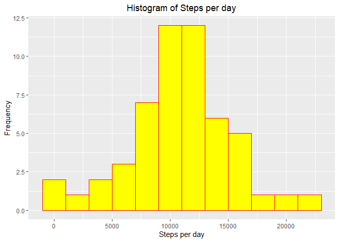
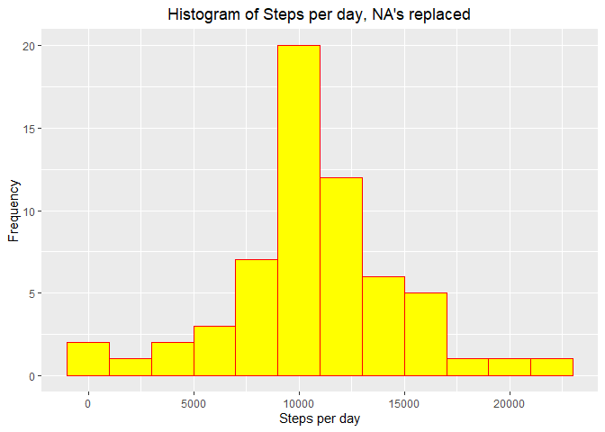
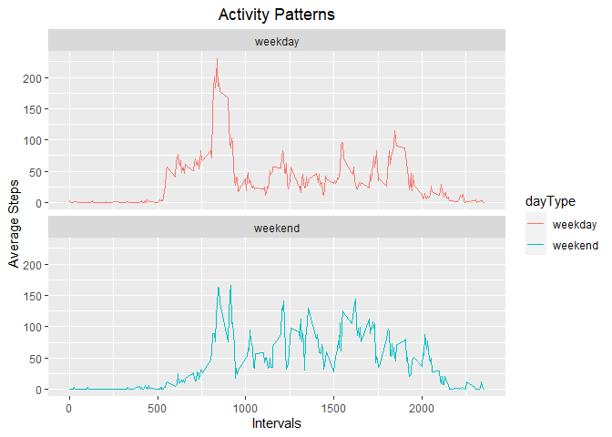

## Introduction

It is now possible to collect a large amount of data about personal
movement using activity monitoring devices such as a
[Fitbit](http://www.fitbit.com), [Nike
Fuelband](http://www.nike.com/us/en_us/c/nikeplus-fuelband), or
[Jawbone Up](https://jawbone.com/up). These type of devices are part of
the "quantified self" movement -- a group of enthusiasts who take
measurements about themselves regularly to improve their health, to
find patterns in their behavior, or because they are tech geeks. But
these data remain under-utilized both because the raw data are hard to
obtain and there is a lack of statistical methods and software for
processing and interpreting the data.

This assignment makes use of data from a personal activity monitoring
device. This device collects data at 5 minute intervals through out the
day. The data consists of two months of data from an anonymous
individual collected during the months of October and November, 2012
and include the number of steps taken in 5 minute intervals each day.

## Data

The data for this assignment was downloaded from thecourse website:

* Dataset: [Activity monitoring data](https://d396qusza40orc.cloudfront.net/repdata%2Fdata%2Factivity.zip) [52K]

The variables included in this dataset are:

* **steps**: Number of steps taking in a 5-minute interval (missing
    values are coded as `NA`)

* **date**: The date on which the measurement was taken in YYYY-MM-DD
    format

* **interval**: Identifier for the 5-minute interval in which
    measurement was taken

The dataset is stored in a comma-separated-value (CSV) file and there
are a total of 17,568 observations in this
dataset.

## Load all the necessary packages

```r
library(knitr)
opts_chunk$set(echo =TRUE)
library(dplyr)
```

```
## 
## Attaching package: 'dplyr'
```

```
## The following objects are masked from 'package:stats':
## 
##     filter, lag
```

```
## The following objects are masked from 'package:base':
## 
##     intersect, setdiff, setequal, union
```

```r
library(ggplot2)
```

## Loading and preprocessing the data

```r
if(!file.exists("activity.csv")){
    unzip('activity.zip')
}
activity <- read.csv("activity.csv")
activity$date <- as.Date(activity$date)
```

## What is mean total number of steps taken per day?

Total number of steps per day

```r
totalStep <- activity %>%
      filter(!is.na(steps)) %>%
      group_by(date) %>% 
      summarize(total=sum(steps,na.rm = TRUE)) %>%
            print
```

```
## `summarise()` ungrouping output (override with `.groups` argument)
```

```
## # A tibble: 53 x 2
##    date       total
##    <date>     <int>
##  1 2012-10-02   126
##  2 2012-10-03 11352
##  3 2012-10-04 12116
##  4 2012-10-05 13294
##  5 2012-10-06 15420
##  6 2012-10-07 11015
##  7 2012-10-09 12811
##  8 2012-10-10  9900
##  9 2012-10-11 10304
## 10 2012-10-12 17382
## # ... with 43 more rows
```
Plot histogram for the total steps by day

```r
ggplot(data = totalStep,aes(x = total))+
      geom_histogram(binwidth = 2000, color= "red", fill="yellow")+
      labs(title = "Histogram of Steps per day", x = "Steps per day", y = "Frequency")+
      theme(plot.title = element_text(hjust = 0.5))
```

<!-- -->

Calculate the mean and median total steps per day

```r
mean(totalStep$total)
```

```
## [1] 10766.19
```

```r
median(totalStep$total)
```

```
## [1] 10765
```
## What is the average daily activity pattern?
Calculating average steps

```r
interval <- activity %>%
  filter(!is.na(steps)) %>%
  group_by(interval) %>%
  summarize(steps = mean(steps))
```

```
## `summarise()` ungrouping output (override with `.groups` argument)
```
Plot time series graph

```r
ggplot(interval,aes(x = interval,y = steps))+
      geom_line(color="red")
```

<!-- -->

Finding interval that has the maximum number of steps on average

```r
max <- interval[which.max(interval$steps),]
```
The interval that has the maximum number of steps on average is: 835

## Imputing missing values

Report the number of missing values

```r
sum(is.na(activity))
```

```
## [1] 2304
```

Imputing NA's and creat new dataset


```r
new_dat <- activity
nas <- is.na(new_dat$steps)
avg_interval <- tapply(new_dat$steps, new_dat$interval, mean, na.rm=TRUE, simplify=TRUE)
new_dat$steps[nas] <- avg_interval[as.character(new_dat$interval[nas])]
```

Calculate total steps

```r
totalStep <- new_dat %>%
  group_by(date) %>%
  summarize(steps = sum(steps)) %>%
  print
```

```
## `summarise()` ungrouping output (override with `.groups` argument)
```

```
## # A tibble: 61 x 2
##    date        steps
##    <date>      <dbl>
##  1 2012-10-01 10766.
##  2 2012-10-02   126 
##  3 2012-10-03 11352 
##  4 2012-10-04 12116 
##  5 2012-10-05 13294 
##  6 2012-10-06 15420 
##  7 2012-10-07 11015 
##  8 2012-10-08 10766.
##  9 2012-10-09 12811 
## 10 2012-10-10  9900 
## # ... with 51 more rows
```
Plotting histogram of the total number of steps taken each day


```r
ggplot(totalStep, aes(x = steps)) +
  geom_histogram(color="red",fill = "yellow",binwidth = 2000) +
  labs(title = "Histogram of Steps per day, NA's replaced", x = "Steps per day", y = "Frequency")+
      theme(plot.title = element_text(hjust = 0.5))
```

<!-- -->

Calculating mean and median

```r
mean(totalStep$steps)
```

```
## [1] 10766.19
```

```r
median(totalStep$steps)
```

```
## [1] 10766.19
```

Imputing missing data have only a little and transcurable impact on the mean ant the median of the total daily number of steps. Watching the histogram we can note than the only bin that is changed is the interval between 10000 and 12500 steps, grown from a frequency of 18 to a frequency of 26. Different methods for replace missing values could cause different results.

## Are there differences in activity patterns between weekdays and weekends?

Create a new factor variable for weekday and weekend


```r
new_dat<- mutate(new_dat,dayType=ifelse(weekdays(new_dat$date) == "Saturday" | weekdays(new_dat$date) == "Sunday", "weekend", "weekday"))
new_dat$weektype <- as.factor(new_dat$dayType)
head(new_dat)
```

```
##       steps       date interval dayType weektype
## 1 1.7169811 2012-10-01        0 weekday  weekday
## 2 0.3396226 2012-10-01        5 weekday  weekday
## 3 0.1320755 2012-10-01       10 weekday  weekday
## 4 0.1509434 2012-10-01       15 weekday  weekday
## 5 0.0754717 2012-10-01       20 weekday  weekday
## 6 2.0943396 2012-10-01       25 weekday  weekday
```
Average steos in 5 min intervals

```r
interval <- new_dat %>%
  group_by(interval, dayType) %>%
  summarize(steps = mean(steps))
```

```
## `summarise()` regrouping output by 'interval' (override with `.groups` argument)
```

Plotting time series graph


```r
ggplot(interval, aes(x=interval, y=steps, color = dayType)) +
  geom_line() +
  facet_wrap(~dayType, ncol = 1, nrow=2)+
  labs(x = "Intervals", y = "Average Steps", title = "Activity Patterns")+
theme(plot.title =element_text(hjust = 0.5) )
```

<!-- -->

To conclude it seems subjected person has an earlier start in the week days with a peak between 8am and 9am. On weekends, the activity seems more spread between 8am and 8pm.
